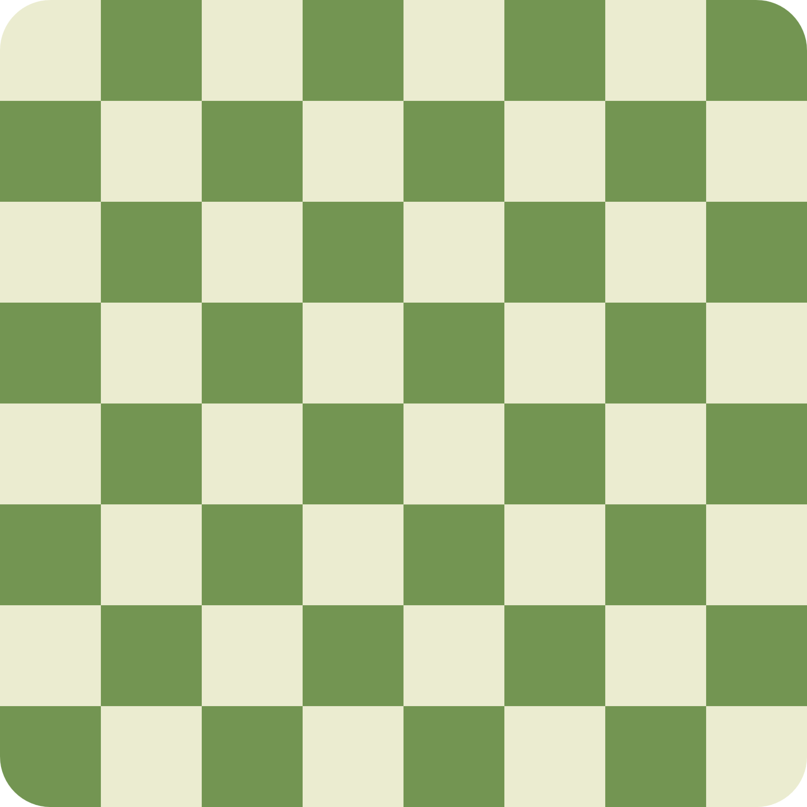

#  ChessBot

Real-time stockfish chess analyzer browser extension for [chess.com](https://www.chess.com)

https://github.com/user-attachments/assets/c03eb3d6-8c9c-4524-868a-8d2fba2fe480

# Browser Compatability

| Browser        | Supported Version | Notes                                  |
|----------------|-------------------|----------------------------------------|
|  Chrome         | 88+              | ✅ Fully supported                        |
|  Firefox        | 109+              | ✅ Fully supported                        |
|  Safari         | -               | ❓ Not tested                             |
|  Edge           | -               | ❓ Not tested                             |
|  Opera          | -               | ❓ Not tested                             |

# How to install?

- **Firefox**  
  Firefox users are in luck! Our extension can be installed from the official [Mozilla Add-Ons site](https://addons.mozilla.org/en-US/firefox/addon/chessbot/).

- **Any other browser**  
  You will have to manually install the addon. First, [download the repository](https://github.com/BoraOfficial/ChessBot/archive/refs/heads/main.zip), then extract the “extension” folder. The installation process after can vary a lot. Here is a general overview of how it can be done on Google Chrome:
  1. Navigate to `chrome://extensions/`
  2. Turn on Developer Mode, by toggling it on the top right of the page.
  4. After developer mode is turned on, plenty of buttons will appear on the top left, simply click on `Load Unpacked`
  5. Select the extracted “extension” folder.

---

<b>‼️The code and content in this repository are provided "as is" without any warranties or guarantees. Use at your own risk. The author is not liable for any damages arising from the use of this repository.</b>
